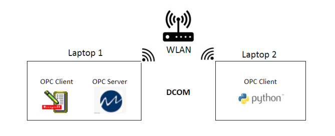

# MPC-Case-Study - Nagaraj Prakash, Prathamesh Kolekar, Srinidhi Subbanna
Comparision of MPC and Override Control for Level control problem. We have used a process simulation on Honeywell's Unisim as our plant. The override control strategy is developed in Unisim and the MPC is developed using DO-MPC library in Python. This repository contains everything to reproduce our experiments and the detailed instructions on hot to run the project can be found in the Project Report.

## Requirements

- Python 3.8 (32-bit, as OPC DA is not supported in 64-bit Python)
- Numpy
- CasADi
- Matplotlib
- PDB
- sys
- DO-MPC
- os
- pywintypes
- time
- OpenOPC
- Honeywell Unisim R451
- Matricon OPC server for simulation and testing (OPC DA)
- Matricon OPC explorer (OPC DA)


## Instructions

### Getting started: Cloning the repository to local machine
```bash
git clone https://github.com/nprakash13/MPC-Case-Study.git
cd MPC-Case-Study
```

### Running Override Control:
As a prerequisite, we need HoneyWell Unisim R451 with `UniSimDesign.Process` and `UniSimDesign.Dynamic` licences. With valid licenses, the Unisim Case file from `MPC-Case-Study/Unisim/Override Model/` can be opened and start the simulation with either default settings or with user preferred settings. The Setpoints of Override conroller and the flow controller can be modified on the spreadsheet element 'SPR-10'. The disturbances to the system can also be modified using the 'FC-10' inlet valve controller.

### Running MPC Controller:
We have used Python's DO-MPC library for MPC controller and since OPC-DA is the only comm-protocol suppoorted by Unisim R451, we exchange data between Unisim and Python using OPC-DA. The usual setup consists of a Windows machine with Unisim and Matricon OPC server and other windows machine with MPC on Python. However Unisim simulations and Python controller can run on the same machine. 


Make sure that the DCOM settings are correctly configured. We have configure Alais names for the Matricon OPC server objects and used the Alias names throughout the project. So the configuration file from `MPC-Case-Study/Matricon/Server` can be loaded in Matricon OPC server. This configuration can be tested using Matricon Client from a different machine. The client connection configuration file can be found in `MPC-Case-Study/Matricon/Client` or User can configure their client easily with [3-4 steps](https://www.youtube.com/watch?v=IJ8zm3uSAU8).

Use the Unisim Case file from `MPC-Case-Study/Unisim/MPC Model/` with Unisim licenses `UniSimDesign.Process` and `UniSimDesign.Dynamic`. Staft the simulation with preferred settings. Once the Unisim simulations start running, run the python script [Batch_reactor.py](https://github.com/nprakash13/MPC-Case-Study/blob/main/Python%20MPC/Batch_reactor1.py).
 
 
